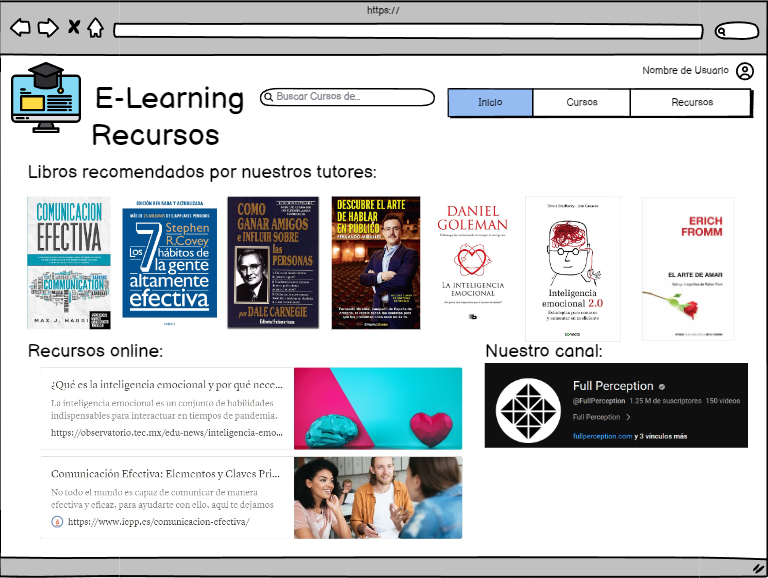

# Historia: Mostrar recursos de la plataforma

- Yo como: Usuario
- Quiero: Ver los recursos base de la plataforma
- Para: Poder revisar bibliografia y webgrafia base

## Pendientes de definición.

Ninguno

## Especificación de requerimientos.

1. Se deben mostrar los recursos solo con links e imagenes, si no tiene ambos creados no se los mostrará

## Analisis

### Pantalla de recursos

A continuación se presenta la pantalla de recursos.

1. El usuario ingresa a la pestaña recursos.
2. El usuario deberá obtener todos los recursos para aprender más a fondo los temas de los cursos y de donde se tomaron como base para dichos cursos...



### Pantalla de subida de imagen

## Criterios de aceptacion

Gherkin

### mostrar recursos con links e imagenes validas

- Dado: Que el usuario revisa la pestaña de recursos
- Cuando: Este por mirar los recursos
- Entonces: El sistema debe validar que los recursos obtenidos tengan links e imagenes validas

## Disenio

### Pantalla recursos

1. Para obtener recursos validos:

Request:

```
GET http://localhost:8080/api/v1/subjects/resources
Accept: Application/json
Authorization: Bearer JWT
```

Response: Exitoso statusCode: 200

```
[
    {
        "id_subject": 1,
        "title_subject": "Programación en Java",
        "resources": [
            {
                "id_resource": 1,
                "resource_type": "Libro",
                "resource_name": "Effective Java",
                "resource_link": "https://www.amazon.com/Effective-Java-Joshua-Bloch/dp/0134685997",
                "resource_img": "https://images-na.ssl-images-amazon.com/images/I/51wl0zDcLTL.jpg"
            },
            {
                "id_resource": 2,
                "resource_type": "Artículo",
                "resource_name": "Java Concurrency in Practice",
                "resource_link": "https://www.example.com/articles/java-concurrency",
                "resource_img": "https://example.com/path/to/article_image.jpg"
            }
        ]
    }
]

```

Response: No encontrado statusCode: 404

```
[
{
    "code" : "ERROR 404",
    "result" : null,
    "message" : "Recursos no encontrados"
}

]
```
