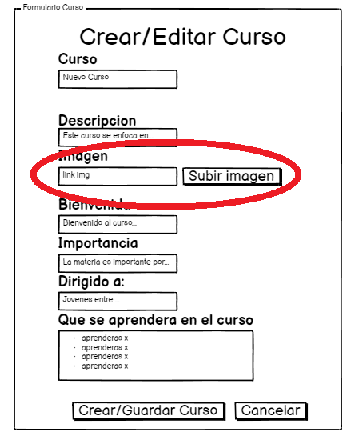
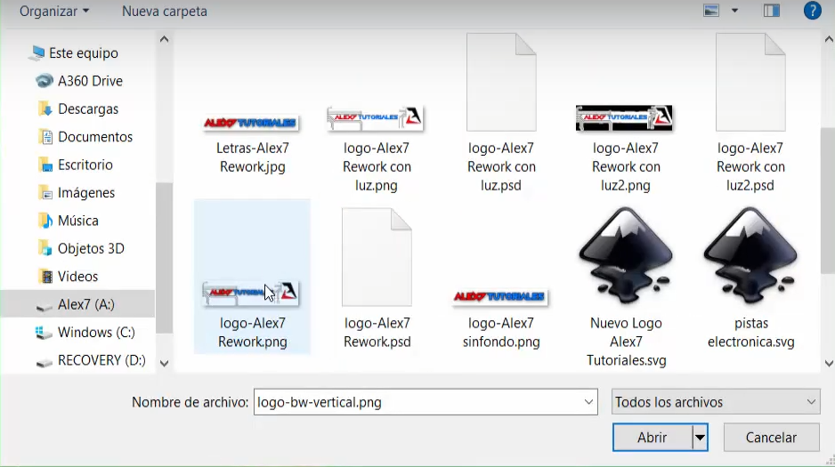

# Historia: Subir imagenes del curso

- Yo como: Administrador de la plataforma
- Quiero: Subir imagenes de mi curso
- Para: Poder mostrar a mis estudiantes mi curso

## Pendientes de definición.

Ninguno

## Especificación de requerimientos.

1. Se deben subir solo una imagen en formato png, jpg, webp de almenos 460x200, 30ppi, aspect ratio de 16:9.

## Analisis

### Pantalla de subida de imagen

A continuación se presenta la pantalla de subida de imagen.

1. El docente hace clic en subir imagen.
2. El docente debera elegir una imagen para su curso y despues subirla...

### Pantalla de subida de imagen

## Criterios de aceptacion

Gherkin

### Validacion de imagen

- Dado: Que el Administrador quiere subir una imagen
- Cuando: Este por elegir la imagen a subir
- Entonces: El sistema debe validar que la imagen cumpla con los requisitos minimos de calidad de imagen.

## Diseño

### Pantalla recursos

Se hara con firebase y despues se hara un POST de la URL de la imagen segun el link proporcionado que dé firebase.
