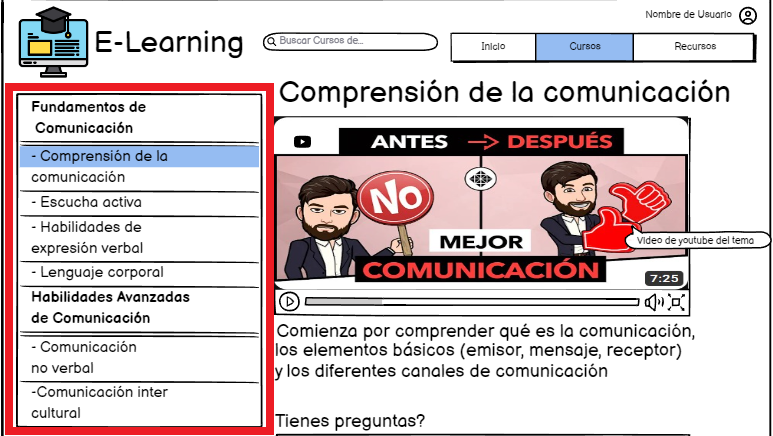

# Historia: Modificar curso

- Yo como: Administrador.
- Quiero: Realizar la modificacion de un curso.
- Para: Actualizarlo entre los cursos disponibles.

## Especificación de requerimientos.

1. Mostrar los campos del curso a modificar. 
2. Modificar el curso.

## Analisis

### Pantalla del modificion de curso

A continuación se presenta la pantalla de modificacion, cuyo funcionamiento es.

1. El administrador ingreso a la pagina de modificacion de curso.
2. El administrador observa los campos para la modificacion del curso.




## Criterios de aceptacion

### Mostrar formulario de modificacion del curso

- Dado: Que el administrador desea modificar un curso.
- Cuando: Reemplaze los campos del curso y presione el boton de guardar.
- Entonces: Se actualizan los campos del curso.

## Disenio

### Mostrar formulario de modificacion del curso.

1. Para realizar la modificacion del curso:

Request:
```
PUT http://localhost:8080/api/v1/subjects
Accept: Application/json
Authorization: Bearer JWT
```

Response: Exitoso statusCode: 200
```
{
    "id_subject": 1,
    "img_link": "https://example.com/path/to/image1.jpg",
    "title_subject": "Programación en C++",
    "description_subject": "Aprende los fundamentos de la programación en C++ desde cero."
}
```

Response: No encontrado statusCode: 404
```

```


