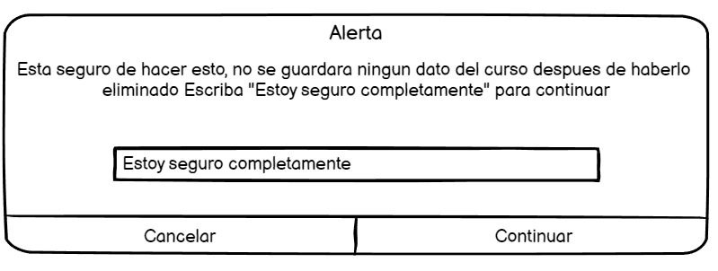

# Historia: Eliminar un curso

- Yo como: Administrador
- Quiero: poder eliminar un curso
- Para: eliminar un curso completamente

## Pendientes de definición.

Ninguno

## Especificación de requerimientos.

1. Se deben eliminar en cascada todos los recursos del curso
2. Se debe mostrar un mensaje de confirmacion antes de eliminar el curso "Esta seguro de hacer esto, no se guardara ningun dato del curso despues de haberlo eliminado" Y escribir "Estoy seguro completamente" para poder proceder

## Analisis

### Pantalla de cursos

A continuación se presenta la pantalla de cursos donde se puede acceder al boton eliminar.

1. El adminsitrador ingresa a la pestaña recursos.
2. El usuario deberá presionar el boton eliminar para proceder con la eliminacion...



### Pantalla de verificacion de eliminacion

## Criterios de aceptacion

Gherkin

### Verificar que se eliminen todos los recursos del curso

- Dado: Que el administrador decida eliminar un curso
- Cuando: Este lo elimine definitivamente
- Entonces: El sistema debe validar que todos los archivos provenientes del curso se hayan eliminado correctamente de la base de datos.

### Verificar que el administrador este seguro de eliminar el curso

- Dado: Que el administrador quiera eliminar un curso
- Cuando: Este por eliminar un curso
- Entonces: El sistema debe validar este seguro de lo que esta haciendo mostrando un mensaje de alerta: "Esta seguro de hacer esto, no se guardara ningun dato del curso despues de haberlo eliminado" Escriba "Estoy seguro completamente para continuar".
  Entonces se podra eliminar el curso

## Disenio

### Pantalla de cursos

1. Para eliminar el curso:

Request:

```
DELETE http://localhost:8080/api/v1/subjects/{id}

```

Response: Exitoso statusCode: 200

```
[
{
    "code" : "CODE-1000",
    "result" : null,
    "message" : "El curso fue eliminado con exito"
}

]

```

Response: No encontrado statusCode: 404

```
[
{
    "code" : "ERROR 404",
    "result" : null,
    "message" : "El curso no ha sido encontrado"
}

]
```
