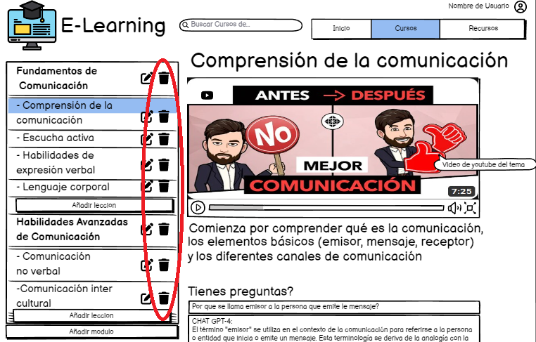
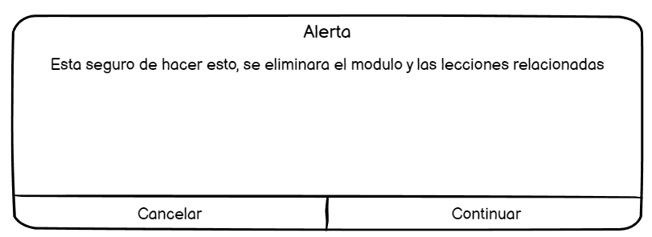

# Historia: Eliminar un modulo

- Yo como: Administrador
- Quiero: poder eliminar un modulo de un curso
- Para: eliminar un modulo y sus lecciones

## Pendientes de definición.

Ninguno

## Especificación de requerimientos.

1. Se deben eliminar en cascada todos los recursos del modulo, esto incluye las lecciones que contenga
2. Se debe mostrar un mensaje de confirmacion antes de eliminar el modulo "Esta seguro de hacer esto, se eliminara el modulo y las lecciones relacionadas" Y aceptar si esta seguro

## Analisis

### Pantalla de cursos

A continuación se presenta la pantalla de cursos donde se puede acceder al boton eliminar.

1. El administrador ingresa al ucrso.
2. El administrador deberá presionar el boton eliminar un modulo para eliminarlo...




### Pantalla de verificacion de eliminacion

## Criterios de aceptacion

Gherkin

### Verificar que se elimine el modulo y las lecciones relacionadas

- Dado: Que el administrador decida eliminar un modulo
- Cuando: Este lo elimine definitivamente
- Entonces: El sistema debe validar que todas las lecciones relacionadas al modulo sean eliminados tambien.

### Verificar que el administrador este seguro de eliminar el modulo

- Dado: Que el administrador quiera eliminar un curso
- Cuando: Este por eliminar un curso
- Entonces: El sistema debe validar este seguro de lo que esta haciendo mostrando un mensaje de alerta: "Esta seguro de hacer esto, se eliminara el modulo y las lecciones relacionadas" Escriba " y debe dar en aceptar para continuar

## Disenño

### Pantalla de cursos

1. Para eliminar el modulo:

Request:

```
DELETE http://localhost:8080/api/v1/subjects/modules/{id}

```

Response: Exitoso statusCode: 200

```
[
{
    "code" : "CODE-1000",
    "result" : null,
    "message" : "El modulo fue eliminado con exito"
}

]

```

Response: No encontrado statusCode: 404

```
[
{
    "code" : "ERROR 404",
    "result" : null,
    "message" : "El modulo no ha sido encontrado"
}

]
```
