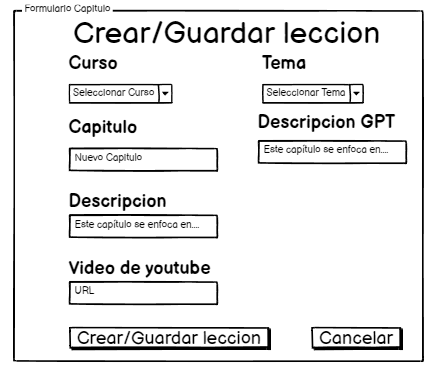

# Historia: Modificar leccion

- Yo como: Administrador
- Quiero: poder modificar una leccion
- Para: modificar el contenido de mi leccion o renovarlo

## Pendientes de definición.

Ninguno

## Especificación de requerimientos.

1. Se deben guardar todos los cambios hechos en la leccion

## Analisis

### Pantalla de lecciones

A continuación se presenta la pantalla de lecciones donde se puede modificar la leccion

1. El administrador ingresa al curso y clickea en la leccion a modificar.
2. El administrador deberá cambiar informacion en la leccion y guardarla.



### Pantalla de modificacion de lecciones

## Criterios de aceptacion

Gherkin

### Se deben guardar todos los cambios hechos en la leccion

- Dado: Que el administrador decida modificar una leccion
- Cuando: Este modifique la leccion
- Entonces: El sistema debe guardar las modificaciones realizadas en la leccion.

## Diseño

### Pantalla de lecciones

1. Para modificar leccion:

Request:

```
PUT http://localhost:8080/api/v1/subjects/modules/lesson/{id}
Accept: Application/json
Authorization: Bearer JWT

[
{
        "id_lesson": 101,
        "lesson_name": "¿Qué es Java?",
        "link_ytvideo": "https://www.youtube.com/watch?v=example1",
        "description_lesson": "Introducción al lenguaje de programación Java y su historia."
    }


]

```

Response: Exitoso statusCode: 200

```

```

[
{
"code" : "SUCCES 200",
"result" : null,
"message" : "El modulo no ha sido modificado con exito"
}

]

```


```

Response: No encontrado statusCode: 404

```
[
{
    "code" : "ERROR 404",
    "result" : null,
    "message" : "El modulo no ha sido encontrado"
}

]
```
