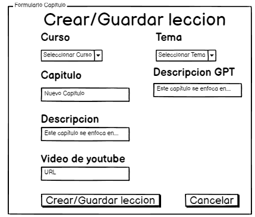

# Historia: Crear leccion

- Yo como: Instructor
- Quiero: poder crear una lección
- Para: añadir contenido a un módulo específico del curso

## Pendientes de definición.

Ninguno

## Especificación de requerimientos.

1. Se deben guardar todos los cambios hechos en la leccion
2. Definir las validaciones de los campos de entrada.
3. Asegurar la gestión de permisos para que solo los administradores puedan crear lecciones.
4. Diseñar la interfaz de usuario para la creación de lecciones.

## Analisis

### Pantalla de lecciones

El Instructor podrá ingresar al módulo del curso y crear una nueva lección a través de una interfaz específica.

El Instructor selecciona el módulo y hace clic en "Crear lección".
El Instructor añade información en la lección y la guarda.



### Pantalla de modificacion de lecciones

## Criterios de aceptacion

Gherkin

# Escenario: Creación exitosa de una lección

- Dado que el administrador ha proporcionado información válida para una nueva lección
- Cuando hace clic en el botón de "Guardar Lección"
- Entonces el sistema debe guardar la lección en el módulo correspondiente y debe mostrar un mensaje de "Lección creada con éxito"

# Escenario: Validaciones de campos al crear una lección

- Dado que el administrador ha iniciado sesión en el panel de administración
- Cuando intenta crear una lección con campos faltantes o inválidos
- Entonces el sistema debe mostrar mensajes de error correspondientes a cada campo de validación fallido y no debe permitir la creación de la lección hasta que todos los campos sean válidos

# Escenario: Creación de lección con permisos adecuados

- Dado que el usuario intenta crear una lección
- Cuando no tiene permisos de administrador
- Entonces el sistema debe mostrar un mensaje de error de "Permiso denegado" y no debe permitir la creación de la lección

## Diseño

### Pantalla de lecciones

1. Para crear leccion:

Request:

```
POST /api/v1/subjects/{subjectId}/modules/{moduleId}/lessons
Accept: application/json
Authorization: Bearer JWT
Content-Type: application/json

{
    "lesson_name": "¿Qué es Java?",
    "link_ytvideo": "https://www.youtube.com/watch?v=example1",
    "description_lesson": "Introducción al lenguaje de programación Java y su historia."
}
```

Response: Exitoso statusCode: 201

```

{
    "code": "SUCCESS 201",
    "result": {
        "id_lesson": 101,
        "lesson_name": "¿Qué es Java?",
        "link_ytvideo": "https://www.youtube.com/watch?v=example1",
        "description_lesson": "Introducción al lenguaje de programación Java y su historia."
    },
    "message": "La lección ha sido creada con éxito"
}

```

Response: Error statusCode: 404

```
{
"code": "ERROR 404",
"result": null,
"message": "La lección no pudo ser creada - Módulo no encontrado"
}
```
