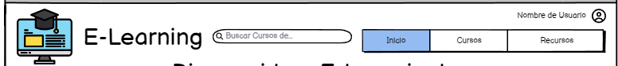

# Historia: Barra de navegacion.

- Yo como: Usuario
- Quiero: Poder hacer click en la barra de navegacion y etiquetas.
- Para: Cambiar de pestaña.

## Pendientes de definición.

1. Ninguno

## Especificación de requerimientos.

1. Muestre datos del usuario como iniciado de sesion
2. Muestre boton de log out para cuando el usuario quiera salir de la sesion

## Analisis

### Pantalla de creacion de nueva subasta

A continuación se presenta la barra de navegacion.

1. El usuario hizo clic previamente en Cursos
2. El usuario deberá tener la lista de cursos disponibles.
3. El usuario hizo clic en recursos
4. El usuario deberá obtener la lista de recursos de los cursos.

### Pantalla de subida de imagen

## Criterios de aceptacion

### Cerrar sesion

- Dado: Que el usuario inico sesión y desea cerrar sesion.
- Cuando: De clic al boton de cerrar sesion.
- Entonces: El sistema debe cerrar la sesion quitando token y no guardando ninguna informacion del usuario.
