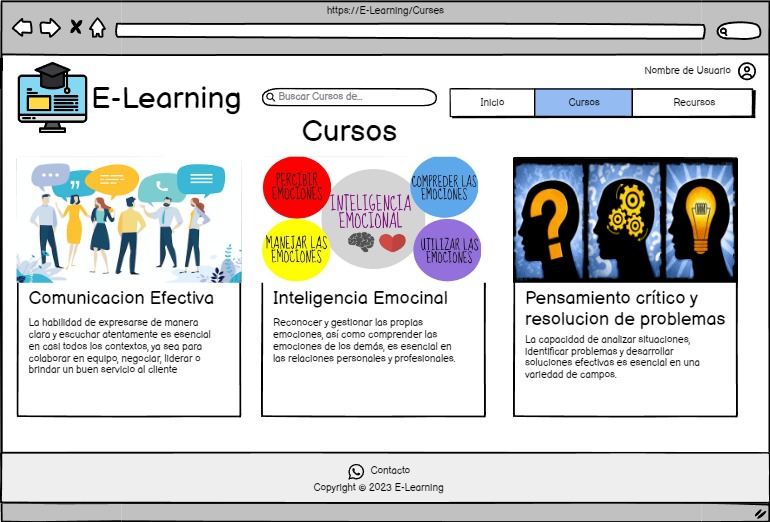

# Historia: Listar cursos.

- Yo como: Usuario
- Quiero: Poder ver todos los cursos disponbiles
- Para: Poder entrar a ver el contenido de los cursos

## Pendientes de definición.

1. si la aplicacion es un exito, entonces podriamos añadir un buscador de cursos

## Especificación de requerimientos.

1. La cantidad maxima de cursos por linea seran 3.
2. Al momento de obtener la imagen, El tamaño maximo de una imagen para pc sera 600x400, aspect ratio de 16:9. Archivos JPG.
3. Al momento de obtener la imagen, El tamaño maximo de una imagen para celular sera 300x200, aspect ratio de 16:9. Archivos JPG.
4. listar cursos por pagina, paginar 6 cursos por pagina

## Analisis

### Pantalla de creacion de nueva subasta

A continuación se presenta la pantalla cursos, cuyo funcionamiento es.

1. El usuario hizo clic previamente en Cursos.
2. El usuario deberá tener lista de los cursos disponibles...



### Pantalla de subida de imagen

## Disenio

### Pantalla de obtener cursos

1. Para obtener la lista de cursos:

Request:

```
GET http://localhost:8080/api/v1/subjects
Accept: Application/json
Authorization: Bearer JWT
```

Response: Exitoso statusCode: 200

```
[
    {
        "id_subject": 1,
        "img_link": "https://example.com/path/to/image1.jpg",
        "title_subject": "Programación en Java",
        "description_subject": "Aprende los fundamentos de la programación en Java desde cero."
    },
    {
        "id_subject": 2,
        "img_link": "https://example.com/path/to/image2.jpg",
        "title_subject": "Diseño Web Responsive",
        "description_subject": "Descubre cómo crear sitios web adaptables a cualquier dispositivo."
    },
    {
        "id_subject": 3,
        "img_link": "https://example.com/path/to/image3.jpg",
        "title_subject": "Introducción a Machine Learning",
        "description_subject": "Aprende los conceptos básicos y herramientas del aprendizaje automático."
    }
]
```

Response: No encontrado statusCode: 404

```
[
{
    "code" : "ERROR 404",
    "result" : null,
    "message" : "Ningun curso encontrado"
}

]
```
