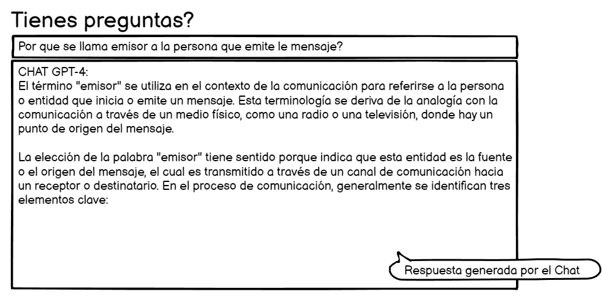

# Historia: Preguntas y respuestas con chat GPT

- Yo como: Usuario
- Quiero: Ver el chat de preguntas
- Para: Poder realizar preguntas que tenga sobre la leccion

## Pendientes de definición.

1. ¿Se guardaran las preguntas?
   R. Si, pero no se le mostraran al usuario

## Especificación de requerimientos.

1. La cantidad minima de caracteres por pregunta
2. Rechaza la pregunta si hace preguntas indebidas o fuera del tema

## Analisis

### Pantalla de modulos y lecciones con una leccion de ejemplo

A continuación se presenta la pantalla de modulos y lecciones.

1. El usuario ingresa su pregunta en la entrada.
2. El usuario deberá obtener una respuesta a su pregunta según la duda que tenga...



### Pantalla de subida de imagen

## Criterios de aceptacion

Gherkin

### cantidad minima de caracteres por pregunta

- Dado: Que el usuario tiene una pregunta por hacer
- Cuando: Este por escribir la pregunta que tenga
- Entonces: El sistema debe validar que subio al menos 20 caracteres como entrada.

### Rechaza la pregunta si hace preguntas indebidas o fuera del tema

- Dado: Que el usuario tiene una pregunta
- Cuando: Este por escribir la pregunta que sea indebida o fuera del tema
- Entonces: El sistema debe dar una respuesta de pregunta invalida.

## Disenio

### Pantalla de respueta del chat

1. Para obtener respuestas a las preguntas hechas por el usuario:

Request:

```
GET http://localhost:8080/api/v1/gpt/api/
Accept: Application/json
Authorization: Bearer tu_token_de_acceso
```

Response: Exitoso statusCode: 200

```
[
    "respuesta": {
    "definicion": "El término 'emisor' se refiere a la persona o entidad que envía o comunica un mensaje. Proviene del latín 'emittere', que significa 'enviar hacia afuera'.",
    "contexto_comunicacion": "En el proceso de comunicación, el emisor es quien codifica y envía el mensaje al receptor, iniciando el acto comunicativo.",
    "rol": "El emisor es fundamental en la comunicación ya que es el punto de origen de la información o mensaje que se quiere transmitir."
  }
]
```

Response: No encontrado statusCode: 404

```
[
{
    "code" : "ERROR 404",
    "result" : null,
    "message" : "Ingrese al menos un pregunta mas precisa de mas de 20 caracteres"
}

]
```

2. Para obtener respuestas a las preguntas indebidas hechas por el usuario:

```

Response: No encontrado statusCode: 404

```

[
{
"code" : "ERROR 404",
"result" : null,
"message" : "Pregunta no autorizada, por favor revise que la pregunta tenga que ver con el tema, gracias!"
}

]

```

```
